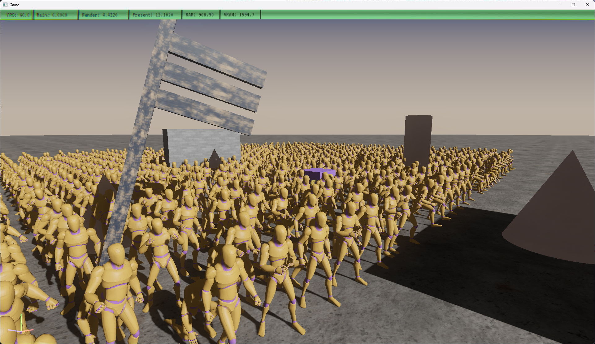

# stakeforge_engine

Stakeforge is my on-going new engine project, it's successor to [Lina Engine](https://github.com/inanevin/LinaEngine).

This time I'm focusing on developing extremely-fast, performance oriented engine framework, that tries to generalize/abstract less functionality than before. Idea is:

-  non-existing or minimal/simplistic editor as custom editor development in Lina has been my biggest time consumer.
- less platform support -> less time spent on maintainence, ditching Vulkan and Metal support and effectively MacOS (at least until stuff is more feature-complete).
- production friendly workflow, fast shader & gltf pipelines.
- project oriented, doesn't try to introduce complicated build and project management. spending time on custom build systems, dll based c++ scripting and alike has not proven worthy in Lina. In stakeforge just copy-paste the engine code and modify a subset of the code to implement a new game.
- <b>performance</b>: idea is that Stakeforge produces executables that just run, fast :) No/little dynamic memory allocation, data-oriented code, parallelism, simple API.

running 1.42 ms median cpu time calculating 1024 characters with total of 50K+ bones :v:

## At the moment we have:

- DoD entity & component system, supporting all the basics.
- DoD resource management, aimed at no-hastle hot-reloading and simplicity.
- Basic components, audio, physics, lights etc.
- Jolt physics integration.
- Miniaudio based simple audio system.
- Proper game loop, variant delta based or fixed-timesteps with interpolation, along with Tracy profiler integration and custom in-engine frame-time tracking and memory tracking.
- A very fast animation graph supporting state machines, transitions, 1D/2D blending, joint masking etc.
- Bunch of platform, io, serialization, input, memory and other pipelinining utilities.
- A pretty cute PBR renderer running on DX12 on windows;
	- Runs a deferred pipeline using prepass depth.
	- Supports full GLTF PBR workflow.
	- Point, spot and directional lights.
	- Traditional shadows for point and spots, cascaded shadow maps for directional lights.
	- Physically-correct bloom running on compute.
	- Half-res HBAO and upsampling in compute shaders.
	- Basics for Post-FX pipeline.
	- GUI & canvas rendering for game-world.
- New data-oriented vector-graphics & widget system integrated into the engine.
- Very cute retro-aesthetics debug console.

## Misc

Stuff is constantly under development, I am seeing what's needed on the way, but idea is to put an open-source game(s) out there as soon as possible before making big plans :) Please do hit up the discussions and issues, I'd be happy to discuss any ideas, contributions, bugs etc.

### building/project

CMake based build system, tested on variety of MSVC versions, using C++23 features, should be straightforward on Windows. Can be made to run on Clang easily with couple of tweaks. only Win32 platform backend for now, rendering requires DX12 support with Shader Model 6.6 and above.

### vendor

-  [fmt](https://github.com/fmtlib/fmt)
-  [lz4](https://github.com/lz4/lz4)
-  [phmap](https://github.com/greg7mdp/parallel-hashmap)
-  [Jolt Physics](https://github.com/jrouwe/JoltPhysics)
-  [stb](https://github.com/nothings/stb)
-  [moodycamel](https://github.com/cameron314/concurrentqueue)
-  [miniaudio](https://github.com/nlohmann/json)
-  [json](https://github.com/nlohmann/json)
-  [tinygltf](https://github.com/syoyo/tinygltf)

# [License (BSD 2-clause)](http://opensource.org/licenses/BSD-2-Clause)

	Copyright [2025-] Inan Evin
	
	Redistribution and use in source and binary forms, with or without modification,
	are permitted provided that the following conditions are met:
	
	   1. Redistributions of source code must retain the above copyright notice, this
	      list of conditions and the following disclaimer.
	
	   2. Redistributions in binary form must reproduce the above copyright notice,
	      this list of conditions and the following disclaimer in the documentation
	      and/or other materials provided with the distribution.
	
	THIS SOFTWARE IS PROVIDED BY THE COPYRIGHT HOLDERS AND CONTRIBUTORS "AS IS" AND
	ANY EXPRESS OR IMPLIED WARRANTIES, INCLUDING, BUT NOT LIMITED TO, THE IMPLIED
	WARRANTIES OF MERCHANTABILITY AND FITNESS FOR A PARTICULAR PURPOSE ARE DISCLAIMED.
	IN NO EVENT SHALL THE COPYRIGHT HOLDER OR CONTRIBUTORS BE LIABLE FOR ANY DIRECT,
	INDIRECT, INCIDENTAL, SPECIAL, EXEMPLARY, OR CONSEQUENTIAL DAMAGES (INCLUDING,
	BUT NOT LIMITED TO, PROCUREMENT OF SUBSTITUTE GOODS OR SERVICES; LOSS OF USE,
	DATA, OR PROFITS; OR BUSINESS INTERRUPTION) HOWEVER CAUSED AND ON ANY THEORY
	OF LIABILITY, WHETHER IN CONTRACT, STRICT LIABILITY, OR TORT (INCLUDING NEGLIGENCE
	OR OTHERWISE) ARISING IN ANY WAY OUT OF THE USE OF THIS SOFTWARE, EVEN IF ADVISED
	OF THE POSSIBILITY OF SUCH DAMAGE.
